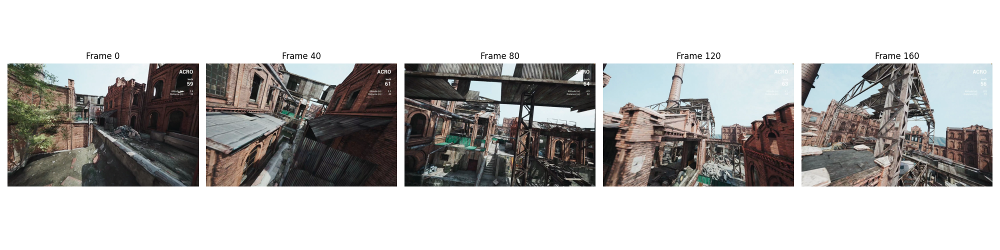
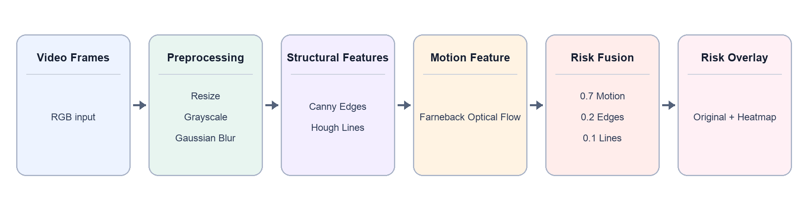
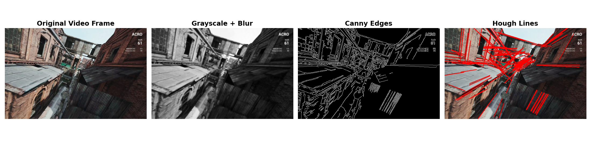
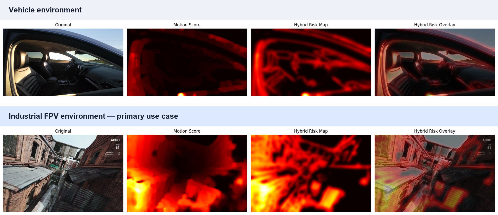
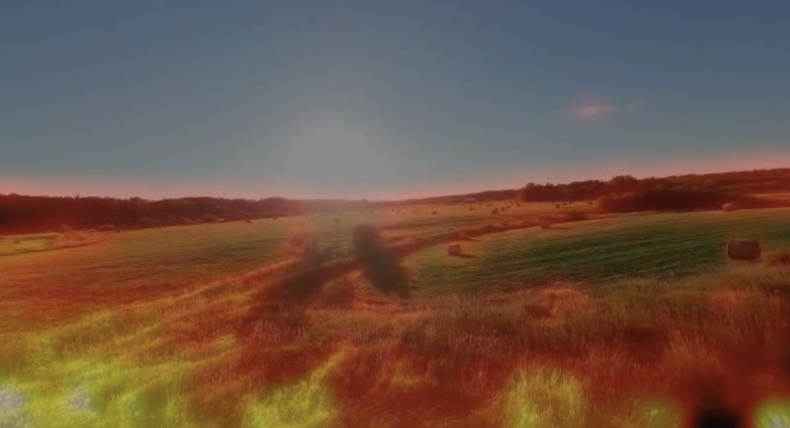

# RiskSight

**RiskSight is a classical computer-vision pipeline that highlights visually risky regions in FPV drone video.** It combines apparent motion, structural boundaries, and dominant lines into an interpretable heatmap—without a trained model or depth sensor.

The output is a **heuristic visual risk score**, not a calibrated probability of danger, a depth estimate, or a flight-safety system.

<table>
  <tr>
    <th>Original FPV Video</th>
    <th>RiskSight Overlay</th>
  </tr>
  <tr>
    <td width="50%">
      
    </td>
    <td width="50%">
      
    </td>
  </tr>
</table>

## Motivation

FPV drones can move quickly through industrial sites, buildings, forests, and other cluttered spaces while the pilot sees only a forward-facing monocular video feed. Without stereo cameras, LiDAR, or another ranging sensor, scene depth and closing distance must be inferred from visual cues. Thin structures, narrow passages, and nearby surfaces can be especially difficult to judge during rapid motion.

<p align="center">
  
</p>

RiskSight explores a lightweight, training-free approach to obstacle awareness. Classical computer vision keeps each intermediate representation inspectable and requires no labeled dataset. The goal is not to reconstruct scene geometry; it is to visualize regions where motion and image structure jointly suggest that additional attention may be useful.

## System Overview

<p align="center">
  
</p>

Frames are resized to 640 pixels wide, converted to grayscale, and blurred. Canny edges and Hough lines provide structural evidence, while dense Farneback optical flow provides a motion cue. The normalized feature maps are fused with fixed weights, thresholded, smoothed, converted to a heatmap, and blended with the original frame.

## System Overview Demo

<p align="center">
  
</p>

The structural branch starts with an RGB video frame. Gaussian smoothing reduces local image noise before Canny edge detection extracts boundaries. The Probabilistic Hough Transform then identifies dominant line segments that may correspond to walls, poles, pipes, beams, rooflines, and other elongated geometry.

## Motion Estimation

<p align="center">
  
</p>

Dense Farneback optical flow estimates apparent pixel motion between frame *t* and frame *t + 1*. Brighter regions in the magnitude map indicate larger flow vectors. This is image motion—not object motion or depth—and therefore includes motion introduced by the drone's own camera.

## Hybrid Risk Estimation

<p align="center">
  
</p>

The implementation combines three normalized feature maps using a fixed heuristic:

```text
Risk = 0.70(Motion) + 0.20(Edges) + 0.10(Lines)
```

Motion is the dominant cue. Edges reinforce local boundaries, while Hough lines emphasize larger geometric structures. Values below the per-frame 45th percentile are suppressed; the remaining map is smoothed, normalized, converted to an OpenCV `HOT` heatmap, and blended with the RGB frame. The result is a heuristic visualization, not a calibrated probability of collision.

## Results Across Different Environments

<p align="center">
  
</p>

The industrial FPV sequence is the primary navigation use case. The vehicle interior provides a structurally different scene in which to inspect the same unchanged parameters. Both examples show the complete progression from input frame to motion score, fused map, and overlay. They are qualitative examples—not a benchmark or evidence of calibrated generalization.

### Vehicle Interior Video

<table>
  <tr>
    <th>Original</th>
    <th>RiskSight</th>
  </tr>
  <tr>
    <td width="50%">
      
    </td>
    <td width="50%">
      
    </td>
  </tr>
</table>

## Quantitative Obstacle-Detection Evaluation

### Evaluation question

RiskSight produces a broad, continuous obstacle-awareness heatmap, not a semantic segmentation. The evaluation therefore asks a detector-oriented question: **does the high-risk response land on independently selected forward-navigation obstacles, and how much of each selected obstacle does it cover?**

Fifty frames were sampled uniformly from the industrial FPV drone video. An annotation pipeline that never receives RiskSight output used `gemini-3.1-flash-lite` to select relevant obstacles and local `facebook/sam2.1-hiera-tiny` to generate object masks. Generation cost approximately `$0.051`. Automated gates excluded six menu/non-navigation frames and eleven frames whose merged masks covered more than half the image, leaving 33 eligible frames.

### Experimental protocol

- Eligible frames were split by alternating temporal samples: 17 validation and 16 held-out test frames.
- The validation split selected a RiskSight threshold of `0.25`; the test split was evaluated once with that threshold frozen.
- Frame *t* masks were compared with RiskSight's map from frames *t* and *t + 1*, matching the pipeline's coordinate frame.
- A 10-pixel spatial tolerance was fixed because RiskSight deliberately smooths risk around structures instead of tracing exact contours.
- Coverage is the fraction of an AI-selected object's mask reached by the thresholded RiskSight response after applying that tolerance.

### Held-out results

The 16 held-out frames contained 54 **AI-selected obstacle instances**:

| Detection and coverage measure | Result |
|---|---:|
| Frames containing a detected obstacle response | **100% (16/16)** |
| Selected instances with ≥1% coverage | **96.3% (52/54)** |
| Selected instances with ≥5% coverage | **88.9% (48/54)** |
| Selected instances with ≥10% coverage | **87.0% (47/54)** |
| Selected instances with ≥25% coverage | **85.2% (46/54)** |
| Selected instances with ≥50% coverage | **74.1% (40/54)** |
| Selected instances with ≥75% coverage | **50.0% (27/54)** |

In plain language, RiskSight placed a meaningful high-risk response on 47 of 54 AI-selected instances and covered at least half of 40 instances. It produced a response on at least one selected obstacle in every held-out frame. The coverage curve also shows the distinction between noticing and fully localizing an obstacle: 96.3% received some response, while 50.0% received at least 75% coverage.

Exact contour agreement was substantially weaker—31.2% tolerant boundary precision, 49.0% boundary recall, and 38.1% boundary F1. This matches the qualitative behavior: RiskSight often identifies the correct structural region but creates a broad, noisy warning field rather than a precise object mask.

### What can—and cannot—be concluded

The strongest supported claim is:

> On 16 held-out frames from the sampled drone sequence, RiskSight covered at least 10% of 47/54 AI-selected obstacle instances using a validation-selected threshold and 10-pixel tolerance.

This is deliberately **not** stated as “87% of all obstacles.” Gemini is capped at four proposals per frame and can omit visible structures; SAM sometimes returns incomplete masks or leaks into neighboring surfaces. Consequently, omitted obstacles are absent from the denominator, and valid RiskSight responses on omitted structures can appear unmatched. The 17 excluded frames also make the reported set easier than the complete sequence.

These results use **AI-generated pseudo-ground truth that has not been human-verified**. They provide reproducible, preliminary evidence of obstacle sensitivity—not safety validation, calibrated collision probability, full-scene detection accuracy, or cross-domain generalization. Machine-readable results are in `outputs/benchmarks/obstacle_detection_drone_ai_50.json`; annotation policy, caching, quality gates, and reproduction commands are documented in `docs/AI_ANNOTATION.md`.

## Failure Case: Textured Open Environments

<p align="center">
  
</p>

Open terrain can produce a strong **flare-out** even when relatively few structures pose an immediate collision hazard. Dense optical flow responds to apparent motion across textured grass, roads, vegetation, and repeated patterns; Canny can also return dense boundaries in these regions. Because RiskSight has neither semantic understanding nor explicit depth, it cannot determine that many of these responses belong to traversable or distant terrain.

Percentile thresholding and Gaussian smoothing can suppress isolated noise and make the display more coherent, but they cannot resolve the underlying ambiguity. A visually strong response should therefore be interpreted as combined motion and structure—not as proof of danger.

## Technical Details

### Dense Farneback optical flow

Farneback flow approximates neighborhoods in consecutive grayscale frames with polynomial expansions and estimates a dense two-dimensional motion field. A dense method is appropriate because RiskSight needs a score across the full image rather than at sparse tracked points. Its magnitude is intuitive to visualize, but dense computation is relatively expensive and sensitive to ego-motion, illumination changes, and weak texture.

### Canny edge detection

Canny combines Gaussian smoothing, gradient estimation, non-maximum suppression, and hysteresis thresholding to produce localized boundaries. Edges add useful structure where flow alone is ambiguous. They remain appearance-dependent: texture can create excessive responses, while low-contrast or motion-blurred hazards may produce weak boundaries.

### Probabilistic Hough Transform

The Probabilistic Hough Transform votes for line hypotheses from the Canny map and returns line segments. It provides a compact cue for dominant built-environment geometry and tolerates some gaps in edge evidence. It favors straight, sufficiently long structures, so curved, irregular, or occluded hazards may be missed while irrelevant architectural lines may still activate.

### Weighted feature fusion

Each map is independently min-max normalized before fusion. Fixed weights combine complementary cues without training, and a per-frame percentile threshold suppresses weaker values. This design is deterministic for the same decoded inputs and library behavior, but it is heuristic: normalization depends on frame extrema, the threshold is scene-relative, and the weights do not adapt to texture or camera motion.

### Design choices

- **Classical CV over deep learning:** no training data is required, and each feature contribution can be inspected directly.
- **Explicit configuration:** algorithm and output parameters are centralized in `src/risksight/config.py`.
- **Modular pipeline:** video I/O, preprocessing, structure, motion, fusion, and visualization are separate, small modules.
- **Reproducible entry points:** dependencies are declared in `pyproject.toml`, the CLI accepts explicit paths, and stable shape/range behavior has lightweight tests.
- **Offline artifact generation:** one run creates diagnostic figures and an overlay video, trading lower complexity for repeated computation and memory use.

## Performance Characteristics

RiskSight currently targets offline analysis and demonstration generation, not real-time flight control. On the recorded CPU benchmark at 640-pixel width, pipeline-only throughput was 26.1 FPS for the drone video and 31.9 FPS for the vehicle video; end-to-end decode/process/encode throughput was 18.5 and 20.7 FPS respectively. Resolution scaling on the drone video measured approximately 99.8 FPS at width 320, 44.8 FPS at 480, 24.8 FPS at 640, and 11.4 FPS at 960. These are hardware- and codec-specific measurements, not universal real-time guarantees.

Dense Farneback optical flow was the primary per-frame computational bottleneck. Runtime and memory use grow with frame count and resolution and depend on video decoding, CPU performance, and codec behavior.

Potential optimizations include streaming adjacent frame pairs, caching intermediate maps, optional frame skipping or reduced resolution, bounded decoding/processing/encoding queues, and profiling OpenCV CUDA flow implementations where supported. Any optimization would need visual regression checks to ensure the risk-map behavior remains intact.

## Limitations

- **Camera ego-motion:** optical flow includes camera translation and rotation, so widespread activation may reflect drone movement rather than an approaching obstacle.
- **No explicit depth:** the pipeline does not recover metric distance or time to collision; flow magnitude is not a depth estimate.
- **No semantic understanding:** edges and lines cannot distinguish a wall from grass, shadows, road markings, or a traversable gap, creating potential false positives.
- **Texture sensitivity:** highly textured scenes can over-activate, while low-texture or motion-blurred hazards may provide too little evidence.
- **Fixed heuristic parameters:** detector settings, fusion weights, and thresholding remain constant across environments and can be sensitive to scene appearance.
- **Frame-relative scoring:** min-max normalization and percentile suppression prevent scores from serving as an absolute scale across scenes.
- **Offline, CPU-heavy processing:** the current workflow loads the resized video before generating artifacts, and dense optical flow is computationally expensive.
- **Pseudo-label uncertainty:** quantitative results use AI-generated annotations from one drone video and are not human-verified or suitable for safety claims.

## Future Work

- Estimate global camera motion and compute **residual optical flow** to reduce ego-motion responses.
- Compare the classical baseline with monocular-depth methods such as MiDaS and Depth Anything V2.
- Explore adaptive weighting while preserving interpretable intermediate feature maps.
- Build a larger, more diverse evaluation set with suitable labels and quantitative metrics.
- Stream and profile the pipeline toward real-time processing.
- Evaluate ROS integration, embedded constraints, and live UAV testing only after latency and failure behavior are characterized.

None of these extensions are implemented in the current repository.

## Setup

Python 3.10 or newer is recommended.

```bash
python -m venv .venv
source .venv/bin/activate
python -m pip install -e .
```

Install the optional test dependency with `python -m pip install -e '.[dev]'`.

## Usage

Process one or more videos:

```bash
risksight path/to/video.mp4 --output-dir outputs
```

With no video arguments, the command looks for `data/car.MP4` and `data/Drone.mp4`. Use a frame limit for a shorter run:

```bash
risksight data/Drone.mp4 --max-frames 50
```

The backward-compatible source-checkout entry point is `python main.py`. A normal run produces sample-frame, Canny, Hough, optical-flow, and fusion figures plus a 20 FPS MP4 overlay.

Run the tests without an external test runner:

```bash
PYTHONPATH=src python -m unittest discover -s tests -v
```

## Repository Structure

```text
.
├── assets/                    # tracked README figures and GIFs
├── annotations/               # Gemini + SAM annotation pipeline
├── annotations_ai_50/         # current 50-frame pseudo-annotation study
├── benchmarks/                # runtime and obstacle-detection evaluation
├── data/                      # local input videos; ignored by Git
├── outputs/                   # generated figures and videos
├── src/risksight/
│   ├── cli.py                 # CLI orchestration
│   ├── config.py              # preserved algorithm parameters
│   ├── preprocessing.py       # grayscale, blur, normalization
│   ├── structure.py           # Canny and Hough features
│   ├── motion.py              # dense Farneback flow
│   ├── pipeline.py            # weighted fusion and overlay
│   ├── video.py               # video decoding and resize
│   └── visualization.py       # diagnostic figures and video export
├── tests/                     # pipeline, annotation, and benchmark checks
├── main.py                    # source-checkout launcher
└── pyproject.toml             # packaging and dependencies
```

Large input videos and generated MP4 files remain local and are not intended for Git tracking.

## Technologies

Python · OpenCV · NumPy · Matplotlib · PyTorch · Transformers · Gemini API · setuptools · unittest

## Project Background

RiskSight originated as a Stanford CS131 computer-vision project investigating interpretable, training-free obstacle-awareness cues for FPV navigation. This repository packages the prototype as a reproducible engineering project while preserving its original algorithm and parameters.
