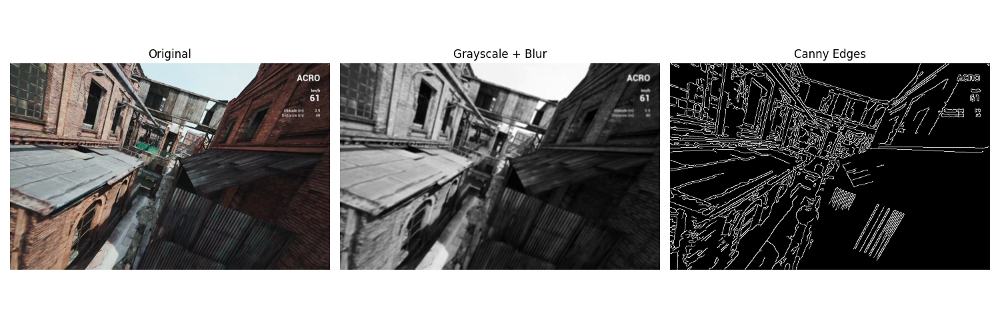
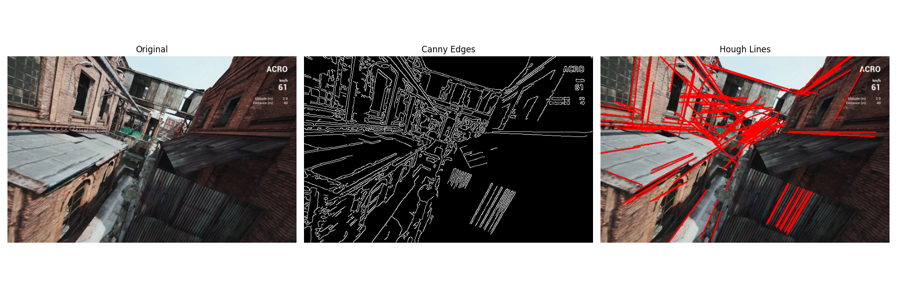
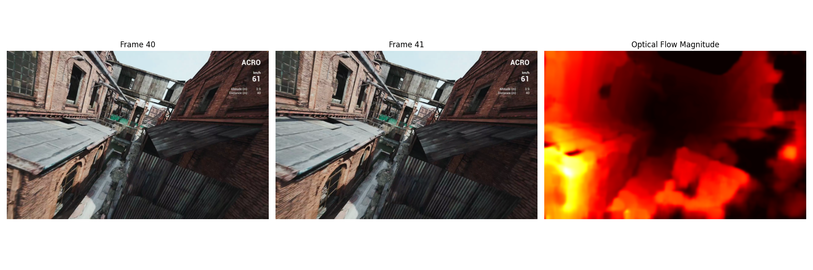
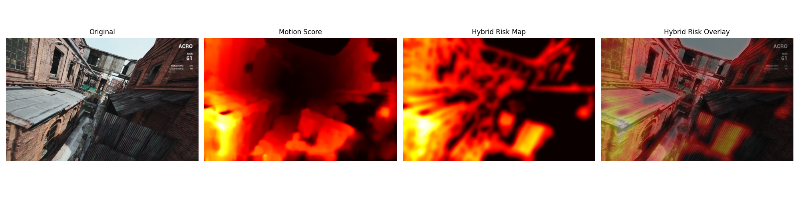

# RiskSight

**RiskSight is a classical computer-vision pipeline that highlights visually risky regions in FPV drone video.** It combines apparent motion, structural boundaries, and dominant lines into an interpretable heatmap—without a trained model or depth sensor.

The output is a **heuristic visual risk score**, not a calibrated probability of danger, a depth estimate, or a flight-safety system.

## Demo

### Vehicle Interior

<table>
  <tr>
    <th>Original</th>
    <th>RiskSight</th>
  </tr>
  <tr>
    <td width="50%">
      
    </td>
    <td width="50%">
      
    </td>
  </tr>
</table>

### FPV Drone

<table>
  <tr>
    <th>Original</th>
    <th>RiskSight</th>
  </tr>
  <tr>
    <td width="50%">
      
    </td>
    <td width="50%">
      
    </td>
  </tr>
</table>

The drone sequence is the primary navigation use case. The vehicle interior provides a structurally different environment in which to inspect the same fixed pipeline; it is not evidence of a quantitative generalization benchmark.

## Motivation

FPV drones can move quickly through industrial sites, buildings, forests, and other cluttered spaces while the pilot sees only a forward-facing monocular video feed. Without stereo cameras, LiDAR, or another ranging sensor, scene depth and closing distance must be inferred from visual cues. Thin structures, narrow passages, and nearby surfaces can be especially difficult to judge during rapid motion.

RiskSight explores a lightweight, training-free approach to obstacle awareness. Classical computer vision is useful here because each intermediate representation can be inspected directly, the pipeline requires no labeled dataset, and its behavior follows from explicit operations and parameters. The goal is not to reconstruct geometry; it is to visualize regions where motion and image structure jointly suggest that additional attention may be useful.

## System Overview

```text
video → decode and resize → grayscale + Gaussian blur ─┬→ Canny edge map ─→ Hough line map ─┐
                                                       └→ dense Farneback optical flow ──────┤
                                                                                             ↓
                                        RGB frame ← heatmap overlay ← smooth + normalize ← fusion
```

For each adjacent frame pair, RiskSight:

1. Resizes frames to 640 pixels wide while preserving aspect ratio.
2. Converts RGB frames to grayscale and applies Gaussian smoothing.
3. Extracts Canny edges, then dilates and smooths them into an edge-influence map.
4. Detects line segments with the Probabilistic Hough Transform and builds a smoothed line map.
5. Computes dense Farneback optical flow and normalizes its magnitude.
6. Combines the three normalized maps with fixed weights.
7. Suppresses values below the 45th percentile, applies a final Gaussian blur, and normalizes the result.
8. Converts the score map to an OpenCV `HOT` heatmap and blends it with the original frame.

The current CLI loads the resized frames before generating demonstration figures and the overlay video. It also exposes `--max-frames` for shorter runs.

## Visual Pipeline

### 1. Structural preprocessing

<p align="center">
  
</p>

The frame is converted to grayscale and blurred before Canny processing. Smoothing reduces local image noise, while the edge map retains strong object contours and scene boundaries.

### 2. Dominant geometry

<p align="center">
  
</p>

The Hough stage extracts prominent line segments from the Canny map. In built environments, these responses often align with walls, poles, pipes, beams, rooflines, and other elongated geometry.

### 3. Apparent motion

<p align="center">
  
</p>

Dense Farneback optical flow estimates a two-dimensional motion vector at each pixel. Its magnitude highlights strong frame-to-frame apparent motion, including motion produced by the drone's own camera.

### 4. Risk fusion

<p align="center">
  
</p>

The implementation combines normalized motion, edge, and line maps using a fixed heuristic:

```text
risk = 0.70 × motion + 0.20 × edges + 0.10 × lines
```

Motion is the largest contribution, while edges and lines reinforce visible structure. Percentile thresholding suppresses weaker responses; smoothing and heatmap blending produce the final visualization. These weights are manually specified parameters, not learned coefficients.

## Key Computer Vision Techniques

### Dense Farneback optical flow

Farneback flow approximates neighborhoods in consecutive grayscale frames with polynomial expansions and estimates a dense motion field. A dense method is appropriate because RiskSight needs a score across the full image rather than motion at a sparse set of tracked keypoints. The resulting magnitude is an intuitive cue for apparent motion and produces an inspectable intermediate map.

Its main tradeoff is cost: dense flow performs substantially more work than sparse feature tracking and is the pipeline's primary computational bottleneck. It also measures image motion rather than object motion or depth, so camera ego-motion, changing illumination, and weak texture can affect the response.

### Canny edge detection

Canny is a gradient-based detector that combines Gaussian smoothing, gradient estimation, non-maximum suppression, and hysteresis thresholding. It produces localized boundaries while rejecting some weaker noise responses. RiskSight uses these boundaries because nearby structures often introduce strong contours even when their motion response alone is ambiguous.

Edges remain appearance-dependent. Highly textured surfaces may create dense responses, while low-contrast or blurred objects can produce weak boundaries. Edges indicate intensity transitions, not object identity or collision risk.

### Probabilistic Hough Transform

The Probabilistic Hough Transform votes for line hypotheses from the edge map and returns line segments rather than an exhaustive parameter-space representation. It provides a compact structural cue for dominant geometry and is reasonably robust to small gaps in edge evidence.

The method favors straight, sufficiently long structures. Curved, irregular, low-contrast, or heavily occluded hazards may not generate useful line segments, while irrelevant architectural or textured lines can still receive a response.

### Weighted feature fusion

Each feature map is min-max normalized before fusion so that motion, edge, and line responses share a comparable numerical range. Fixed weights combine complementary cues without a training stage. After fusion, a per-frame percentile threshold removes weaker values, and Gaussian smoothing creates a continuous display map for heatmap generation.

This design is deterministic for the same decoded frames and library behavior, easy to inspect, and simple to modify experimentally. It is also heuristic: min-max normalization is sensitive to each frame's extrema, percentile thresholding is relative to the current scene, and fixed weights cannot adapt to different motion or texture conditions.

## Technical Design Decisions

- **Classical CV instead of deep learning:** keeps the prototype training-free and exposes the contribution of motion and structural cues. It does not claim the scene understanding available from learned depth or segmentation models.
- **Explainable intermediate maps:** Canny edges, Hough lines, flow magnitude, and fused scores can each be visualized when diagnosing a result.
- **Fixed configuration:** algorithm parameters live in `src/risksight/config.py`, preserving the original implementation values and making changes explicit.
- **Small modular package:** video I/O, preprocessing, structure, motion, fusion, and visualization are separated without introducing a large framework.
- **Reproducible entry points:** `pyproject.toml` declares runtime dependencies, the CLI accepts explicit input/output paths, and stable numerical/shape behavior has lightweight tests.
- **Offline artifact generation:** one command produces the explanatory figures and video overlay used to inspect the pipeline, at the cost of retaining all decoded frames in memory.

## Repository Structure

```text
.
├── assets/                    # tracked README figures and synchronized GIFs
├── data/                      # local input videos; ignored by Git
├── outputs/                   # generated figures/videos; ignored except curated legacy images
├── src/risksight/
│   ├── cli.py                 # argument parsing and per-video orchestration
│   ├── config.py              # preserved algorithm and output parameters
│   ├── preprocessing.py       # grayscale conversion, blur, and normalization
│   ├── structure.py           # Canny edges and Probabilistic Hough lines
│   ├── motion.py              # dense Farneback flow magnitude
│   ├── pipeline.py            # weighted risk fusion and heatmap overlay
│   ├── video.py               # OpenCV decoding, validation, and resize
│   └── visualization.py       # diagnostic figures and overlay-video export
├── tests/test_pipeline.py     # stable shape, range, type, and normalization checks
├── main.py                    # backward-compatible source-checkout launcher
├── pyproject.toml             # package metadata, dependencies, and CLI definition
└── requirements.txt           # minimal compatibility dependency list
```

Large input videos and generated MP4 files remain local and are not intended for Git tracking. The `assets/` directory contains only the curated media needed by this page.

## Setup

Python 3.10 or newer is recommended.

```bash
python -m venv .venv
source .venv/bin/activate
python -m pip install -e .
```

Install the optional test dependency with:

```bash
python -m pip install -e '.[dev]'
```

## Usage

Process one or more videos:

```bash
risksight path/to/video.mp4 --output-dir outputs
```

With no video arguments, the command looks for `data/car.MP4` and `data/Drone.mp4`. Use a frame limit for a short validation run:

```bash
risksight data/Drone.mp4 --max-frames 50
```

The backward-compatible source-checkout entry point is:

```bash
python main.py
```

Inputs must be videos OpenCV can decode. A normal run produces sample-frame, Canny, Hough, optical-flow, and fusion figures plus a 20 FPS MP4 overlay in the selected output directory.

Run the tests without requiring an external test runner:

```bash
PYTHONPATH=src python -m unittest discover -s tests -v
```

## Performance Characteristics

RiskSight currently targets offline analysis and demonstration generation, not real-time flight control. Dense Farneback optical flow is the dominant per-frame computation. The complete workflow also repeatedly computes features for separate figures and the overlay video, and it holds every resized frame in memory before export. End-to-end runtime and memory usage therefore grow with frame count and resized resolution; codec behavior and CPU performance also affect runtime. No FPS benchmark is claimed.

Possible engineering optimizations include:

- streaming adjacent frame pairs instead of retaining the full video;
- reusing intermediate maps across diagnostic and video outputs;
- optional frame skipping or a lower processing resolution;
- separating decoding, processing, and encoding with bounded worker queues;
- profiling NumPy/OpenCV operations before introducing additional concurrency;
- evaluating OpenCV CUDA optical-flow support or other GPU implementations where available.

These changes would require behavioral and visual regression checks before being adopted.

## Limitations

- **Camera ego-motion:** dense flow includes motion caused by camera translation and rotation. Without global motion compensation, widespread activation may reflect drone motion rather than an independently moving or approaching obstacle.
- **No explicit depth:** flow magnitude can correlate with relative motion, but the pipeline does not recover metric distance or time to collision. Stationary or distant structures can be difficult to rank correctly.
- **No semantic understanding:** edges and lines do not distinguish a wall from a shadow, road marking, window frame, or traversable gap. This can produce false positives and contextually misleading overlays.
- **Texture sensitivity:** highly textured grass, roads, and vegetation may generate strong flow or edge responses, while low-texture or motion-blurred hazards may generate weak evidence.
- **Fixed heuristic parameters:** fusion weights, detector settings, and thresholding are manually selected and remain constant across environments. Their behavior can be sensitive to scene appearance and camera motion.
- **Frame-relative normalization:** min-max normalization and percentile suppression depend on the current frame, so displayed intensities are not directly comparable as an absolute risk scale across scenes.
- **Offline, memory-heavy workflow:** all resized frames are loaded before artifacts are generated, and dense flow is relatively expensive on a CPU. The current program is not integrated into a low-latency control loop.
- **Qualitative evaluation only:** the available examples illustrate behavior but do not constitute a labeled benchmark, safety validation, or quantitative comparison against other methods.

## Future Work

- Estimate global camera motion, then compute **residual optical flow** to reduce ego-motion responses.
- Explore adaptive or learned fusion while retaining interpretable feature maps and a classical baseline.
- Add monocular depth as a separately evaluated cue rather than treating optical-flow magnitude as depth.
- Use semantic segmentation to distinguish structural hazards from textured but traversable regions.
- Build a labeled evaluation set with obstacle regions, depth, or time-to-collision targets and report appropriate quantitative metrics.
- Stream frames and profile CPU/GPU implementations toward real-time processing.
- Evaluate ROS integration, embedded deployment constraints, and live UAV video only after latency and failure behavior are characterized.
- Test across more cameras, motion profiles, lighting conditions, indoor scenes, and outdoor environments.

## Technologies Used

- Python
- OpenCV
- NumPy
- Matplotlib
- `pyproject.toml` / setuptools packaging
- `unittest`-compatible behavioral checks

## Project Background

RiskSight originated as a Stanford CS131 computer-vision project investigating interpretable, training-free obstacle-awareness cues for FPV navigation. This repository packages the prototype as a reproducible engineering project while preserving its original algorithm and parameters.
