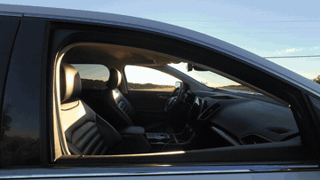
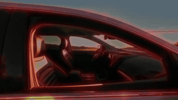
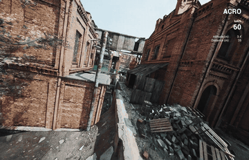
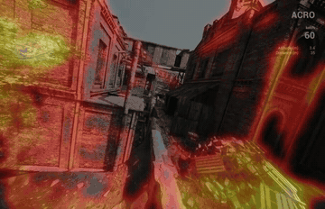
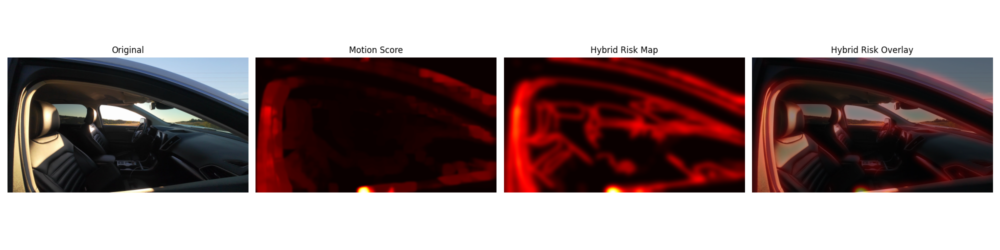

# RiskSight

**A lightweight classical computer-vision pipeline that highlights visually risky regions in FPV drone video.** RiskSight combines apparent motion, object boundaries, and dominant lines into an interpretable hazard-awareness overlay—without a trained model or depth sensor.

## Demo

### Vehicle Interior

<table>
  <tr>
    <th>Original</th>
    <th>RiskSight</th>
  </tr>
  <tr>
    <td width="50%">
      
    </td>
    <td width="50%">
      
    </td>
  </tr>
</table>

### FPV Drone

<table>
  <tr>
    <th>Original</th>
    <th>RiskSight</th>
  </tr>
  <tr>
    <td width="50%">
      
    </td>
    <td width="50%">
      
    </td>
  </tr>
</table>


RiskSight explores whether useful obstacle-awareness cues can be recovered from a single forward-facing camera when stereo depth, LiDAR, and learned depth models are unavailable. Its output is a **heuristic visual risk score**, not a calibrated probability of danger or a replacement for flight-safety systems.

## Pipeline

```text
video → resize/grayscale/blur → Canny edges ─┐
                              Hough lines ───┼→ weighted fusion → threshold → heatmap overlay
                  dense Farneback flow ─────┘
```

The fusion preserves the original project settings:

```text
risk = 0.70 × motion + 0.20 × edges + 0.10 × lines
```

- **Canny edge detection** finds local boundaries and contours.
- **Probabilistic Hough lines** emphasize elongated structures such as walls, poles, pipes, and building edges.
- **Dense Farneback optical flow** measures frame-to-frame apparent motion.
- **Risk fusion** combines the normalized maps, removes responses below the 45th percentile, smooths the result, and overlays a heatmap on the RGB frame.

## Results

The repository includes examples from an industrial flight and a flight through a vehicle interior. A run produces sample frames, edge/Hough/flow visualizations, a four-panel risk-map demo, and an MP4 overlay for each input.



## Setup

Python 3.10 or newer is recommended.

```bash
python -m venv .venv
source .venv/bin/activate
python -m pip install -e .
```

For development and tests, use `python -m pip install -e '.[dev]'`.

## Usage

Process one or more videos:

```bash
risksight path/to/video.mp4 --output-dir outputs
```

With no video arguments, the command looks for the original project samples at `data/car.MP4` and `data/Drone.mp4`. For a quick smoke test:

```bash
risksight data/Drone.mp4 --max-frames 50
```

The legacy entry point remains available after installation:

```bash
python main.py
```

Inputs must be videos OpenCV can decode. Frames are resized to 640 pixels wide while retaining aspect ratio. Outputs are written under `outputs/`; source videos and generated videos are intentionally ignored because they are large.

## Repository structure

```text
src/risksight/
├── cli.py              # command-line orchestration
├── config.py           # preserved algorithm parameters
├── preprocessing.py    # grayscale, blur, normalization
├── structure.py        # Canny and Hough features
├── motion.py           # dense Farneback optical flow
├── pipeline.py         # weighted risk fusion
├── video.py            # video decoding and resize
└── visualization.py    # figures and overlay videos
tests/                  # stable behavioral checks
main.py                 # backward-compatible launcher
```

## Limitations

- Optical flow measures **apparent image motion**, including camera ego-motion. It does not independently distinguish an approaching object from motion caused by the drone itself.
- Highly textured terrain, vegetation, and roads can create strong flow or edge responses even when immediate collision risk is low.
- The method has no explicit depth or semantic understanding and may miss low-texture hazards.
- Fusion weights are fixed heuristics, and results have been evaluated qualitatively rather than against a labeled safety benchmark.
- The current implementation loads a video into memory before producing all demo artifacts.

Potential next steps include estimating global camera motion and using residual flow, evaluating on a larger labeled video set, testing adaptive fusion, and comparing the classical baseline with monocular-depth methods such as MiDaS or Depth Anything V2.

## Project context

RiskSight was developed as a Stanford CS131 computer-vision project focused on interpretable, training-free obstacle-awareness cues for fast FPV navigation.
